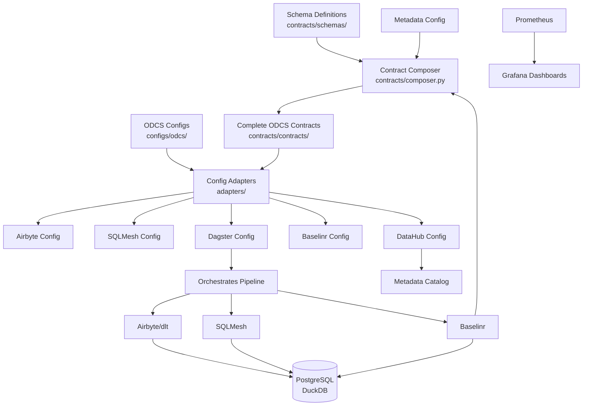

# OSS Data Platform

A complete end-to-end open-source data engineering platform using only fully open-source tools. This platform provides a unified configuration system based on the Open Data Contract Standard (ODCS) with automatic generation of tool-specific configurations.

## Architecture

The platform uses ODCS as the single source of truth for configurations, with a modular contract system where schemas and quality rules are composed into complete contracts. Adapters then generate tool-specific configs from these composed contracts.



## Tool Stack

### Data Ingestion
- **Airbyte** - ELT platform for data integration
- **dlt** - Python-based data load tool

### Data Transformation
- **SQLMesh** - Open-source SQL transformation engine (dbt alternative)

### Orchestration
- **Dagster** - Modern data orchestration platform

### Data Quality
- **Baselinr** - Data profiling, drift detection, and quality monitoring

### Data Catalog
- **DataHub** - Open-source metadata platform

### Monitoring
- **Prometheus** - Metrics collection
- **Grafana** - Metrics visualization

### Storage
- **PostgreSQL** - Primary data warehouse
- **DuckDB** - Analytics engine (optional)

## Quick Start

### 1. Clone and Install Dependencies
```bash
git clone <repo-url>
cd oss-data-platform
make setup
```

This installs all required dependencies including:
- Dagster (orchestration + CLI)
- dlt (data ingestion)
- PostgreSQL drivers
- Baselinr (data quality)

### 2. Start Infrastructure
```bash
make docker-up
```

This starts:
- **PostgreSQL** (localhost:5432) - Data warehouse
- **Dagster UI** (localhost:3000) - Orchestration via Docker
- **Metabase** (localhost:3001) - Dashboards

### 3. Run Assets (Choose One)

**Option A: Local Dagster CLI (Recommended for Development)**
```bash
# List available assets
make dagster-list

# Start local dev server
make dagster-dev
# Open http://localhost:3000
```

**Option B: Docker Dagster**
```bash
# Already running from docker-up
# Open http://localhost:3000
```

### 4. Materialize Data
In Dagster UI (http://localhost:3000):
1. Go to Assets
2. Select `nba_teams`, `nba_games`, etc.
3. Click "Materialize"

Or via CLI:
```bash
dagster asset materialize -f definitions.py --select nba_teams
```

### 5. Query Data
```bash
# Connect to PostgreSQL
docker exec -it oss_data_platform_postgres psql -U postgres -d oss_data_platform

# Query NBA data
SELECT * FROM nba.teams LIMIT 5;
```

## Service URLs

| Service | URL | Description |
|---------|-----|-------------|
| Dagster UI | http://localhost:3000 | Orchestration |
| Metabase | http://localhost:3001 | Dashboards |
| PostgreSQL | localhost:5432 | Database (postgres/postgres) |
| Grafana | http://localhost:3002 | Metrics |
| Prometheus | http://localhost:9090 | Monitoring |

## Contract Composition Workflow

1. **Define schema**: Create schema in `contracts/schemas/nba_games.yml`
2. **Define quality rules**: Create or reference quality rules in `contracts/quality/nba_rules.yml`
3. **Compose contract**: Run `make compose-contracts` or `python contracts/composer.py --schema nba_games --quality nba_rules --output nba_games`
4. **Reference in config**: `configs/odcs/datasets.yml` references `contracts/contracts/nba_games.yml`
5. **Generate tool configs**: Run `make generate-configs` which:
   - Composes contracts if needed
   - Generates tool configs using adapters that read composed contracts

## Project Structure

```
oss-data-platform/
├── contracts/          # ODCS data contracts (modular)
│   ├── schemas/        # Reusable schema definitions
│   ├── quality/        # Reusable quality rule sets
│   └── contracts/      # Complete ODCS contracts (composed)
├── configs/            # Configuration management
│   ├── odcs/           # ODCS source configs
│   └── generated/      # Auto-generated tool configs
├── adapters/           # ODCS → Tool config converters
├── ingestion/          # Data ingestion (Airbyte, dlt)
├── transformation/     # Data transformation (SQLMesh)
├── orchestration/      # Workflow orchestration (Dagster)
├── quality/            # Data quality (Baselinr)
├── catalog/            # Data catalog (DataHub)
├── monitoring/         # Observability (Prometheus, Grafana)
└── storage/            # Data warehouse configs
```

## NBA Data Example

This platform includes a complete NBA data ingestion example:

- **ODCS Contracts**: Schemas and quality rules for NBA data
- **dlt Pipeline**: NBA Stats API integration
- **Dagster Assets**: Orchestrated NBA data ingestion
- **Data Quality**: Baselinr monitoring for NBA datasets
- **ML Pipeline**: Game winner prediction model with betting odds integration

See [docs/guides/nba-ingestion.md](docs/guides/nba-ingestion.md) for the NBA ingestion guide.

### Future: Betting Dashboard

A dashboard to visualize ML predictions, betting odds, and potential payouts is planned. See [docs/guides/nba-betting-dashboard-roadmap.md](docs/guides/nba-betting-dashboard-roadmap.md) for the roadmap.

## Development

See [docs/guides/getting-started.md](docs/guides/getting-started.md) for detailed setup instructions.

## License

Apache 2.0

